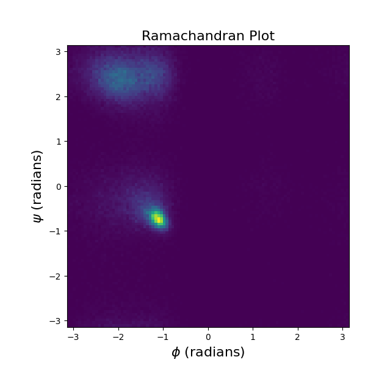
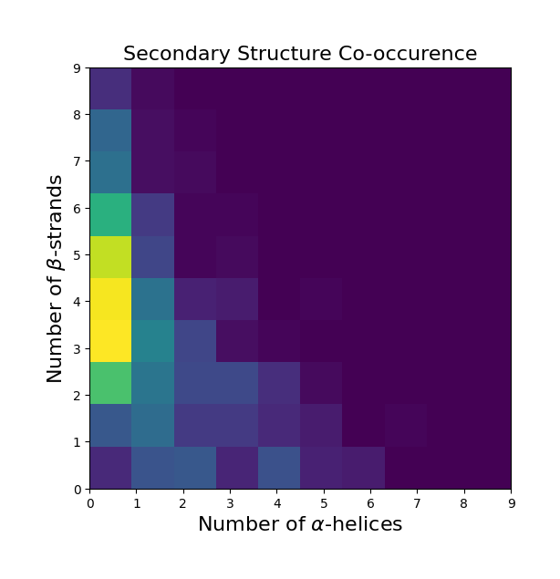

# FoldingDiff

This paper [^1] provides an elegant way of representing protein backbones: their angles. This side-steps the need to work with Cartesian coordinates (in the network at least) and gives us roto-translation equivariance for free. Of course, this comes at the expense of some quirks with the modelling approach.

## Parameterisation
Each residue is represented by three dihedral angles ($\psi$, $\phi$, $\omega$) and three bond angles ($\theta_1$, $\theta_2$, $\theta_3$) as described below. Note that the bond lengths are assumed fixed.

<div align="center">

| Angle | Description |
| :---: | :---------- |
| $\psi$ | Dihedral between N[i], CA[i], C[i], N[i + 1] |
| $\omega$ | Dihedral between CA[i], C[i], N[i + 1], CA[i + 1] |
| $\phi$ | Dihedral between C[i], N[i + 1], CA[i + 1], C[i + 1] |
| $\theta_1$ | Angle between N[i], CA[i], C[i] |
| $\theta_2$ | Angle between CA[i], C[i], N[i + 1] |
| $\theta_3$ | Angle between C[i], N[i + 1], CA[i + 1] |

</div>

As a residue's position depends on the one before it, we can fix the first residue's N, CA, and C atom coordinates, only needing to model the remaining $N - 1$ residues. The entire protein object can hence be summarised as an element of $\mathbb{T}^{6\times (N - 1)}$, where $\mathbb{T}$ is the circle group (i.e. defined by the set of angles with addition modulo $2\pi$ as an operation).

To retrieve its 3D coordinates, the backbone can be built one residue at a time using the _natural extension of reference frame_ (NERF) algorithm [^2]. The angle parameterisation is lossy, but the 3D reconstruction has minimal error (see [^1] Fig S1) which is cool. Do the tiny errors accumulate throughout the chain for really long proteins? While errors from fixing the bond lengths do not scale with length (see [^1] Fig S2), it is very much the case that angular differences from the ground truth can largely impact the resulting structure.

## Diffusion on $\mathbb{T}$

Intuitively, one can imagine noising the angles as usual but then wrapping them between $[0, 2\pi)$ by taking the modulo $2\pi$. Another way to think about this is to visualise $\mathbb{T}$ as a torus and "an angle being noised" as a point doing a random walk on its surface.

Under the DDPM framework, based on [^3] and [^4], the forward process has the transition kernel in the form of a wrapped Gaussian

$$
q(x_{t} \| x_{t - 1}) \propto \sum_{d \in \mathbb{Z}}{\exp\left(-\frac{\lVert x_{t} - \sqrt{1 - \beta_{t}} x_{t - 1} + 2\pi d \rVert^2}{2\beta_t^2}\right)}.
$$

## Architecture Details
We train a denoiser $\epsilon_{\theta}$ acting on the angles. As done in the paper, we have a network composed of:
- Encoder-only transformer (BERT)
    - Relative key positional embeddings
    - Random Fourier features for time embeddings
- MLP head to predict the angles from the BERT embeddings

The loss, a hybrid between an L1 and L2, is given by 

```math
$$
L_{\theta}(x_{0}, t) = \begin{cases}
    d_w(x_{0}, t)^2 / 2 \beta_{L} & \text{if } \lvert d_w(x_{0}, t)\rvert < \beta_L,\\
    \lvert d_w(x_{0}, t) \rvert - \beta_L / 2 & \text{otherwise},
\end{cases}
$$
$$
d_{\theta}(x_{0}, t) = w(\epsilon - \epsilon_{\theta}(w(\sqrt{\bar{\alpha}_{t}} x_{0} + \sqrt{1 - \bar{\alpha}_{t}} \epsilon)), t),
$$
```

where $w(x) = [(x + \pi)\mod 2\pi] + \pi$ wraps angles to be in the interval $[-\pi, \pi)$. We then have the training objective

```math
\mathrm{argmin}_{\theta}\mathbb{E}_{t \sim \mathrm{U}[1, T]}\left[ \mathbb{E}_{x_{0} \sim p_{0}}\left[L_{\theta}(x_{0}, t)\right]\right].
```

We train a smaller version of the model (e.g. fewer attention heads, encoder layers, diffusion timesteps) for 250 epochs with the AdamW optimiser, where the learning rate is linearly scaled from 0 to 5e-5 in the first 25 epochs and back to 0 in the remaining epochs.

## Learning Local vs Global Topology
Like the study, we find our model learns the local topology of proteins, with a mix of $\alpha$-helices and $\beta$-strands as demonstrated by the below plots made up of samples of varying lengths (50-128 residues) from the model.

<p align="middle">

</p>

However, most designs with $\beta$-strands look rather disordered, unlike proteins from the dataset. Since sheets can be formed by strands that are close in distance but possibly far in sequence, it is reasonable to expect that the model is unable (as it was never explicitly incentivised anyway) to adjust intermediate angles to put strands close to each other in 3D space. It is only trained to minimise an MSE on angles, accurately modelling the local topology but missing out on the global coherence of the structure due to an accumulation of errors throughout the backbone.

The _lever-arm effect_ is one instance of such instability in this modelling approach. Below is an illustration.
```
                                   D_1
                 D_1        ┌─┘╲    │
                  └── D_2   └─┐╱    │
                                   D_2

Imagine D_1 and D_2 are large domains connected by a loop.
Tiny changes in the loops' angles can cause large structural changes.
```
It is not so surprising then that collisions can easily form by tweaking some angles.

## Endnote
Despite its caveats, most of which have been addressed by an alternative representation in rigid-body frames, this is among my personal favourite approaches due to its simplicity. It works, and samples really do have nicely formed local helices and wiggly strands.

I feel that the model could be improved with some minimal modifications. Perhaps the model could be additionally supplied by more explicit global features, e.g. contact maps, and probed to also reconstruct it, forcing it to achieve some form of global awareness. However, balancing this joint loss may be a challenge. Another option could be to preserve the diffusion process but use a loss acting on the 3D coordinates, using NERF for reconstruction. A naive application of NERF would be a massive bottleneck, but recent works [^5] can do it in parallel across the sequence dimension. The hope is for the model to get good at getting roughly correct interresidue distances at the expense of a possibly higher MSE with the true set of angles. Finally, largely inspired by AlphaFold2, some form of recycling could be employed where the model initially focuses on local features and iteratively refines it to fold the structure meaningfully, reminiscent of a hierarchical approach. This involves handling a tradeoff between speed and quality.

## References

[^1]: [📖](https://www.nature.com/articles/s41467-024-45051-2) Wu, Kevin E., et al. "Protein structure generation via folding diffusion." Nature communications 15.1 (2024): 1059.

[^2]: [📖](https://people.tamu.edu/~rojas/chemtorsion.pdf) Parsons, Jerod, et al. "Practical conversion from torsion space to Cartesian space for in silico protein synthesis." Journal of computational chemistry 26.10 (2005): 1063-1068.

[^3]: [📖](https://proceedings.neurips.cc/paper_files/paper/2022/file/994545b2308bbbbc97e3e687ea9e464f-Paper-Conference.pdf) Jing, Bowen, et al. "Torsional diffusion for molecular conformer generation." Advances in neural information processing systems 35 (2022): 24240-24253.

[^4]: [📖](https://proceedings.neurips.cc/paper_files/paper/2022/file/105112d52254f86d5854f3da734a52b4-Paper-Conference.pdf) De Bortoli, Valentin, et al. "Riemannian score-based generative modelling." Advances in neural information processing systems 35 (2022): 2406-2422.

[^5]: [📖](https://www.biorxiv.org/content/biorxiv/early/2022/05/29/2022.05.25.493427.full.pdf) Dutton, Oliver, Falk Hoffmann, and Kamil Tamiola. "NeRFax: An efficient and scalable conversion from the internal representation to Cartesian space." bioRxiv (2022): 2022-05.
